# Space-time diagrams

## Configuration A
Initial configuration: `11010100011101010010010000101`

## Configuration A

| Rule 1 | Rule 2 | Rule 3 | Rule 4 | Rule 5 |
|--------|--------|--------|--------|--------|
| 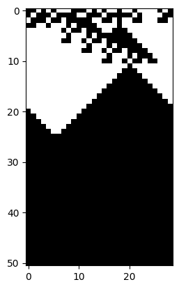 | 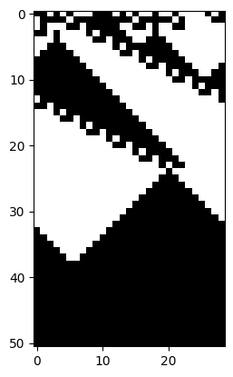 | 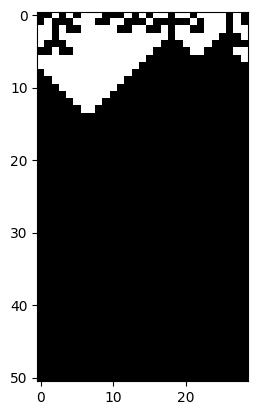 | 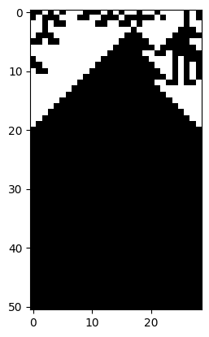 | 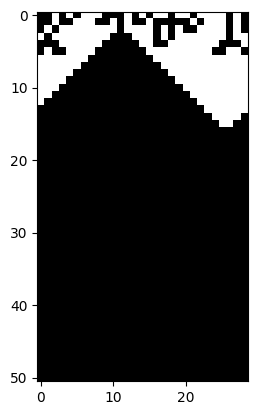 |

| Rule 6 | Rule 7 | Rule 8 | Rule 9 | Rule 10 |
|--------|--------|--------|--------|---------|
| 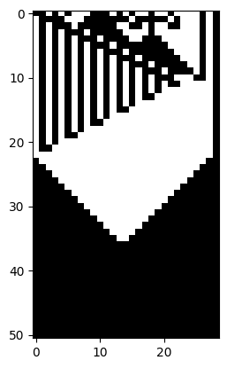 | 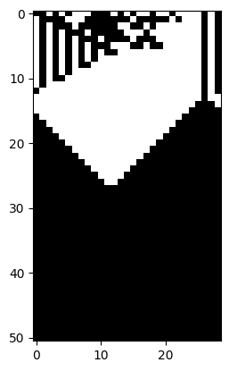 | 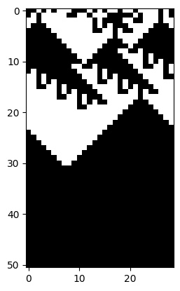 |  | 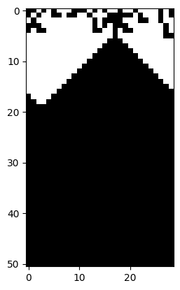 |

| Rule 11 | Rule 12 | Rule 13 | Rule 14 | Rule 15 |
|---------|---------|---------|---------|---------|
|  | 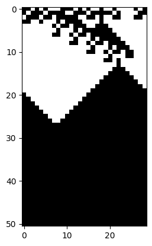 | 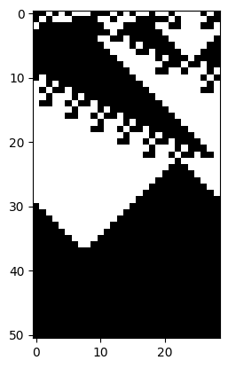 | 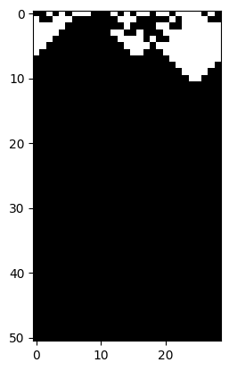 | 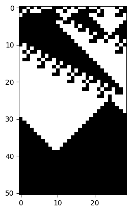 |

| Rule 16 | Rule 17 | Rule 18 | Rule 19 | Rule 20 |
|---------|---------|---------|---------|---------|
| 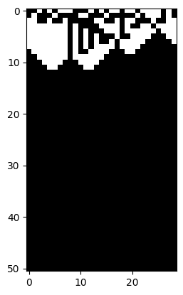 | 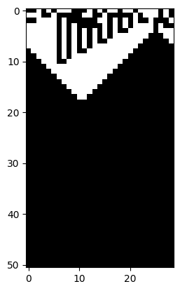 | 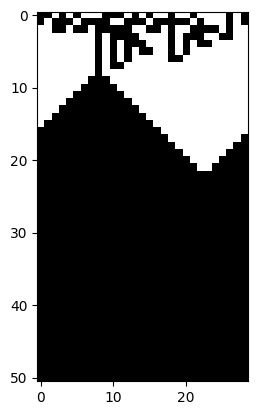 |  | 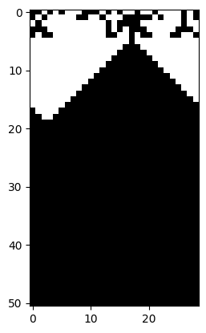 |

## Configuration B
Initial configuration: `11010100011101010110010000101`

| Rule 1 | Rule 2 | Rule 3 | Rule 4 | Rule 5 |
|--------|--------|--------|--------|--------|
| 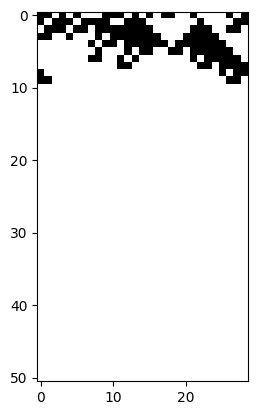 | 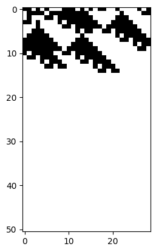 | 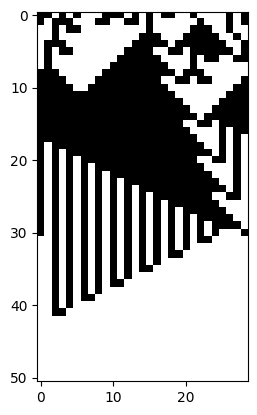 | 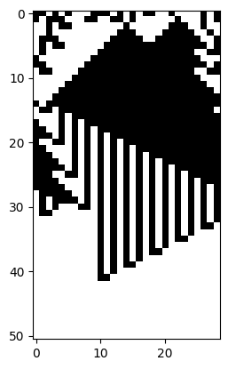 | 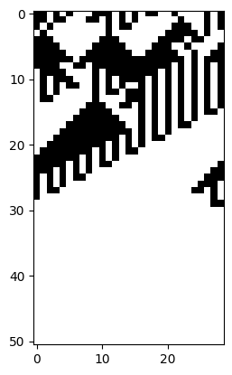 |

| Rule 6 | Rule 7 | Rule 8 | Rule 9 | Rule 10 |
|--------|--------|--------|--------|---------|
| 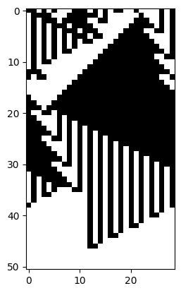 |  | 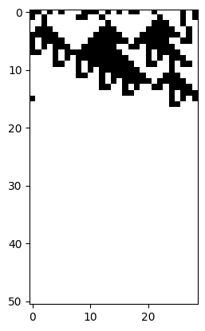 | 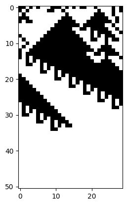 | 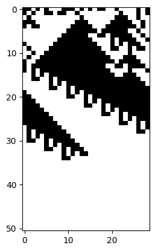 |

| Rule 11 | Rule 12 | Rule 13 | Rule 14 | Rule 15 |
|---------|---------|---------|---------|---------|
| 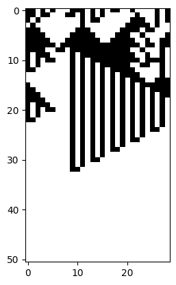 | 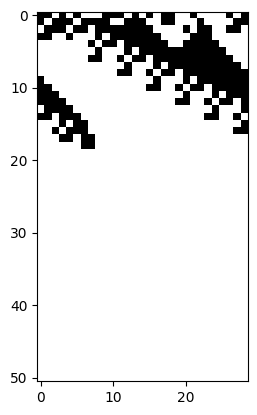 | 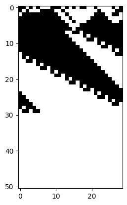 | 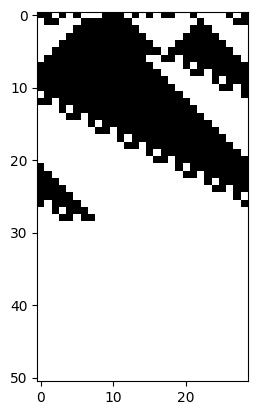 | 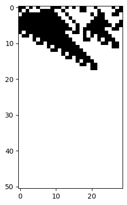 |

| Rule 16 | Rule 17 | Rule 18 | Rule 19 | Rule 20 |
|---------|---------|---------|---------|---------|
| 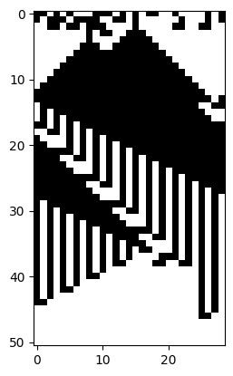 | 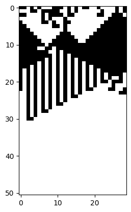 | 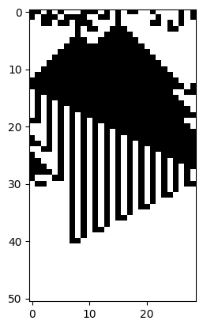 | 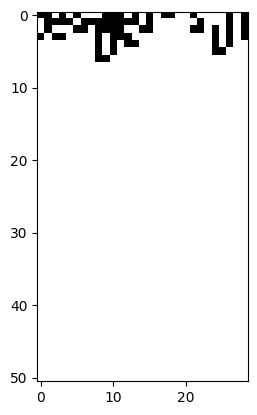 | 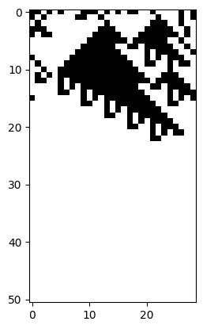 |
